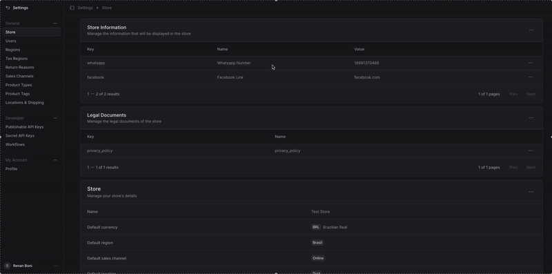

# Medusa Store Info

This is a plugin for Medusa to manage store information.

This plugin enables you to manage store information through a flexible key-value system. You can store and retrieve various types of content including legal documents, store policies, and any other custom information that needs to be accessible throughout your Medusa store. The content can be stored as plain text or markdown format, making it versatile for different use cases.

## Installation

Add this to your `package.json` file:

```bash
"@renanboni/medusa-store-info": "0.0.1"
```

and then run the following command to install the dependencies

```bash
yarn install
```

Then in your `medusa-config.ts` file, you need to add the following under the `plugins` section:

```ts
{
  resolve: "@renanboni/medusa-store-info",
  options: {},
}
```

## Usage



In your storefront, call the api to get the store information:

```ts
const response = await fetch("/store-info")
const data = await response.json()
```

The response will look like this:

```ts
{
    "whatsapp_number": {
        "id": "store_info_id_1",
        "name": "whatsapp number",
        "value": "http://wa.me/1234567890",
        "key": "whatsapp_number", 
        "type": "text"
    },
    "privacy_policy": {
        "id": "store_info_id_2",
        "name": "privacy policy",
        "value": "Your privacy policy content here",
        "key": "privacy_policy",
        "type": "markdown"
    }
}